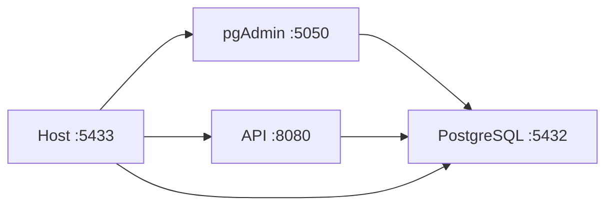

# 🐳 Docker Deployment Guide - JobLink RIWI

## 📋 Prerequisites

- Docker installed (version 20.10+)
- Docker Compose installed (version 2.0+)
- Ports available: 5001, 5050, 5433

## 🚀 Quick Start

### 1. Build and Start All Services

```bash
docker compose up --build -d
```

This command will:
- Build the .NET API from the Dockerfile
- Pull PostgreSQL 16 Alpine image
- Pull pgAdmin image
- Create a Docker network
- Create persistent volumes
- Start all services in detached mode

### 2. Verify Services are Running

```bash
docker compose ps
```

You should see:
```
NAME                 IMAGE                  STATUS
joblink-api          job-api                Up
joblink-postgres     postgres:16-alpine     Up (healthy)
joblink-pgadmin      dpage/pgadmin4         Up
```

### 3. View Logs

```bash
# View all logs
docker compose logs

# Follow logs in real-time
docker compose logs -f

# View API logs only
docker compose logs -f api

# View PostgreSQL logs
docker compose logs -f postgres
```

### 4. Access Services

| Service | URL | Credentials |
|---------|-----|-------------|
| **API** | http://localhost:5001 | N/A (use JWT) |
| **Swagger** | http://localhost:5001/swagger | N/A |
| **pgAdmin** | http://localhost:5050 | Email: admin@joblink.com<br>Password: admin123 |
| **PostgreSQL** | localhost:5433 | User: joblink_user<br>Password: joblink_password_2024<br>DB: joblink_db |

---

## 🔧 Configuration

### Environment Variables

The API service uses the following environment variables (configured in `docker-compose.yml`):

```yaml
ASPNETCORE_ENVIRONMENT: Development
ASPNETCORE_URLS: http://+:8080
ConnectionStrings__DefaultConnection: "Host=postgres;Port=5432;Database=joblink_db;Username=joblink_user;Password=joblink_password_2024"
Jwt__SecretKey: "YourSuperSecretKeyForJWTTokenGeneration2024!@#"
Jwt__Issuer: "JobLinkAPI"
Jwt__Audience: "JobLinkClient"
Jwt__ExpiryInHours: "24"
```

**⚠️ IMPORTANT:** Change these values for production deployment!

---

## 🗄️ Database Setup

### Connect to PostgreSQL via pgAdmin

1. Open http://localhost:5050
2. Login with:
   - Email: `admin@joblink.com`
   - Password: `admin123`

3. Add a new server:
   - **General > Name:** JobLink DB
   - **Connection > Host:** `postgres`
   - **Connection > Port:** `5432`
   - **Connection > Username:** `joblink_user`
   - **Connection > Password:** `joblink_password_2024`
   - **Connection > Database:** `joblink_db`

### Run Migrations (Automatic)

Migrations are automatically applied when the API starts. Check logs:

```bash
docker compose logs api | grep migration
```

### Run Migrations Manually (if needed)

```bash
# Enter the API container
docker compose exec api bash

# Run migrations
dotnet ef database update

# Exit container
exit
```

---

## 🛠️ Common Commands

### Stop Services

```bash
# Stop all services
docker compose stop

# Stop specific service
docker compose stop api
```

### Restart Services

```bash
# Restart all services
docker compose restart

# Restart specific service
docker compose restart api
```

### Rebuild and Restart

```bash
# Rebuild and restart all services
docker compose up --build -d

# Rebuild specific service
docker compose up --build -d api
```

### View Service Status

```bash
docker compose ps
```

### Execute Commands in Container

```bash
# Open bash in API container
docker compose exec api bash

# Open PostgreSQL CLI
docker compose exec postgres psql -U joblink_user -d joblink_db
```

### Remove Everything

```bash
# Stop and remove containers
docker compose down

# Stop, remove containers AND volumes (⚠️ DELETE ALL DATA)
docker compose down -v

# Stop, remove everything including images
docker compose down --rmi all -v
```

---

## 📊 Volume Management

### View Volumes

```bash
docker volume ls | grep job
```

You should see:
- `job_postgres_data` - PostgreSQL data
- `job_pgadmin_data` - pgAdmin settings

### Backup Database Volume

```bash
docker run --rm -v job_postgres_data:/data -v $(pwd):/backup alpine tar czf /backup/postgres_backup.tar.gz /data
```

### Restore Database Volume

```bash
docker run --rm -v job_postgres_data:/data -v $(pwd):/backup alpine tar xzf /backup/postgres_backup.tar.gz -C /
```

---

## 🔍 Troubleshooting

### Port Already in Use

**Error:** `Bind for 0.0.0.0:5001 failed: port is already allocated`

**Solution:**
```bash
# Find process using the port
sudo lsof -i :5001

# Kill the process or change port in docker-compose.yml
ports:
  - "5002:8080"  # Changed from 5001 to 5002
```

### API Not Connecting to Database

**Check:**
1. PostgreSQL is healthy:
   ```bash
   docker compose ps postgres
   ```
   Should show `Up (healthy)`

2. Connection string is correct in `docker-compose.yml`

3. View API logs for errors:
   ```bash
   docker compose logs api
   ```

### Database Migration Fails

**Solution:**
```bash
# Remove database volume and recreate
docker compose down -v
docker compose up --build -d

# Or manually run migrations
docker compose exec api dotnet ef database update
```

### Cannot Access Swagger

**Check:**
1. API is running:
   ```bash
   docker compose ps api
   ```

2. API logs show no errors:
   ```bash
   docker compose logs api
   ```

3. Access http://localhost:5001/swagger (not https)

---

## 🧪 Testing the API

### 1. Health Check

```bash
curl http://localhost:5001/health
```

Expected response:
```json
{
  "status": "healthy",
  "database": "connected"
}
```

### 2. Create a User (if not exists)

```bash
curl -X POST http://localhost:5001/api/auth/register \
  -H "Content-Type: application/json" \
  -d '{
    "username": "testuser",
    "password": "Test123!",
    "email": "test@example.com"
  }'
```

### 3. Login

```bash
curl -X POST http://localhost:5001/api/auth/login \
  -H "Content-Type: application/json" \
  -d '{
    "username": "testuser",
    "password": "Test123!"
  }'
```

Save the returned token for subsequent requests.

### 4. Get All Jobs

```bash
curl -X GET http://localhost:5001/api/jobs \
  -H "Authorization: Bearer YOUR_TOKEN_HERE"
```

---

## 🔐 Security Notes

### For Production

1. **Change default passwords:**
   - PostgreSQL password
   - pgAdmin password
   - JWT secret key

2. **Use environment file:**
   Create `.env` file:
   ```env
   POSTGRES_PASSWORD=your_secure_password
   PGADMIN_PASSWORD=your_admin_password
   JWT_SECRET=your_very_long_secret_key
   ```

   Update `docker-compose.yml` to use `${POSTGRES_PASSWORD}`

3. **Don't expose pgAdmin:**
   Remove pgAdmin service or don't expose port for production

4. **Use HTTPS:**
   Add reverse proxy (nginx) for SSL/TLS

5. **Restrict network access:**
   ```yaml
   networks:
     joblink-network:
       internal: true  # Only internal communication
   ```

---

## 📈 Performance Tuning

### PostgreSQL

Add to `docker-compose.yml` under `postgres > environment`:
```yaml
POSTGRES_SHARED_BUFFERS: 256MB
POSTGRES_WORK_MEM: 6MB
POSTGRES_MAX_CONNECTIONS: 100
```

### API

Add resource limits in `docker-compose.yml`:
```yaml
api:
  deploy:
    resources:
      limits:
        cpus: '0.5'
        memory: 512M
      reservations:
        cpus: '0.25'
        memory: 256M
```

---

## 📝 Docker Compose Services Overview



---

## ✅ Production Checklist

- [ ] Changed all default passwords
- [ ] JWT secret key updated
- [ ] Database backed up
- [ ] Environment variables configured
- [ ] HTTPS/SSL configured
- [ ] Resource limits set
- [ ] Monitoring configured
- [ ] Logging to external service
- [ ] Health checks verified
- [ ] Restart policy set

---

## 📞 Support

For issues or questions:
1. Check logs: `docker compose logs -f`
2. Verify services: `docker compose ps`
3. Review this documentation
4. Check API_DOCUMENTATION.md

---

**Last Updated:** 2025-12-12  
**Docker Compose Version:** 3.8  
**Docker Version:** 20.10+
